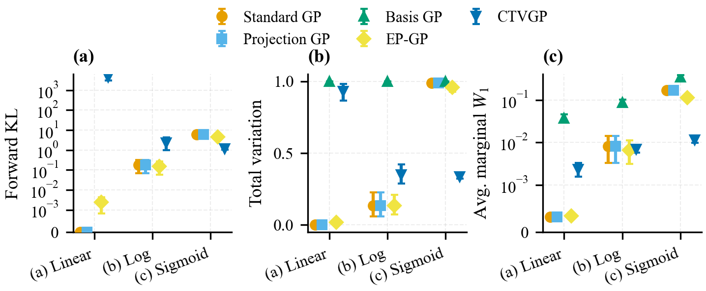
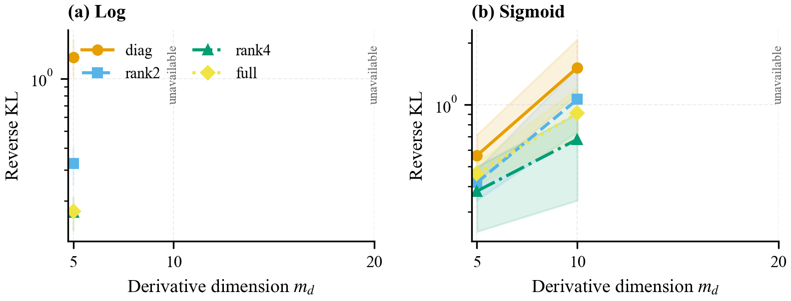
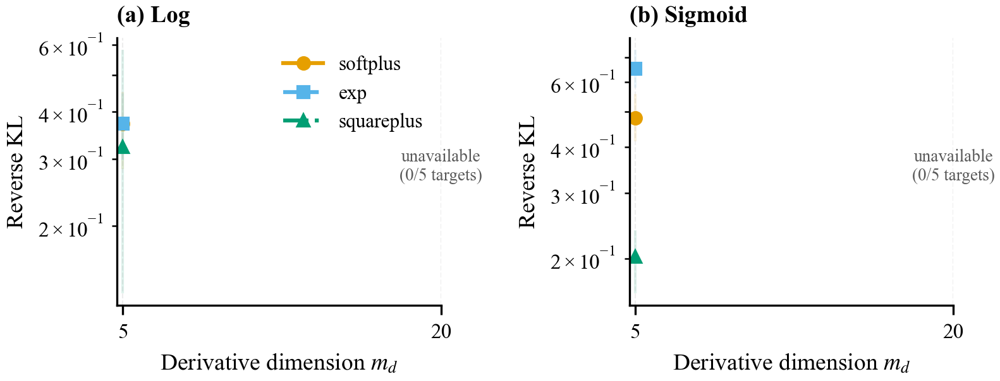
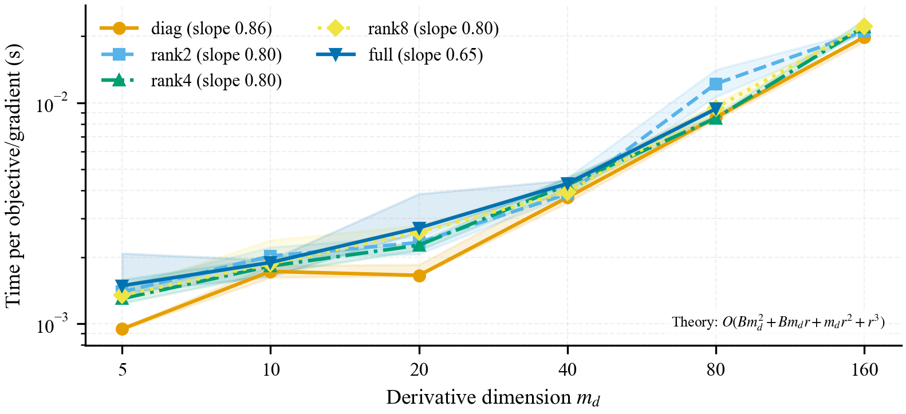
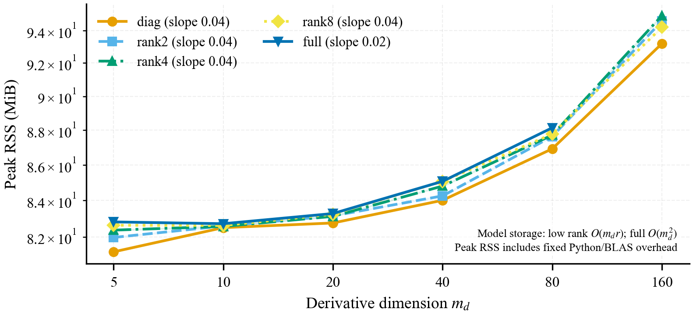
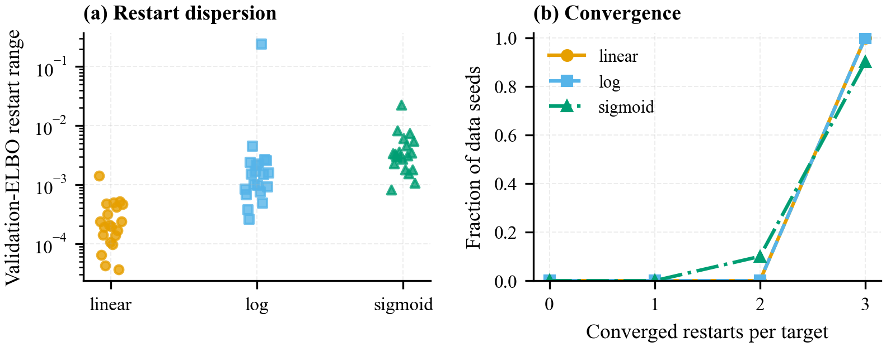
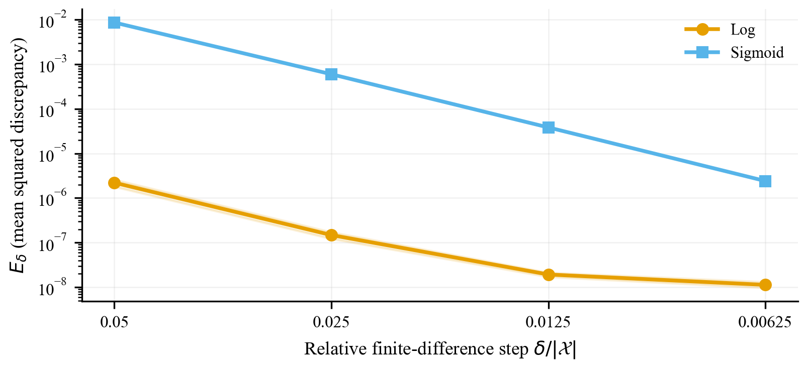
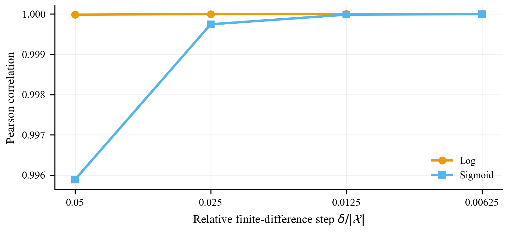
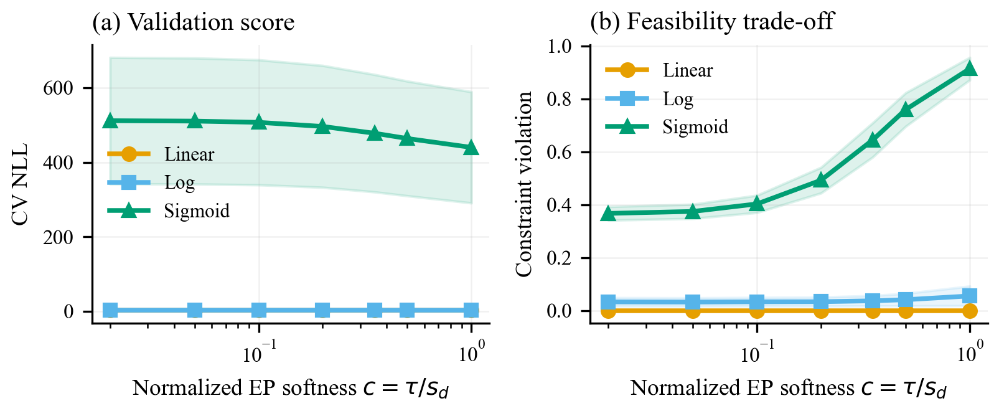

# CTVGP Rebuttal Experiments

This anonymous repository contains the compact experimental artifact used for
the CTVGP rebuttal. It includes the primary rebuttal code, complete aggregated
data, Markdown tables, figures that were not embedded in the rebuttal, and
detailed theoretical proofs.

It intentionally excludes submitted-paper outputs, unrelated earlier
experiments, smoke results, raw Monte Carlo samples, environment dumps, and
execution logs.

## Repository structure

```text
.
|-- code/
|   |-- configs/full.json
|   |-- core.py
|   |-- run_experiments.py
|   |-- run_capacity_extended.py
|   |-- microbenchmark.py
|   |-- aggregate.py
|   |-- make_figures.py
|   |-- make_reports.py
|   `-- validate_artifacts.py
|-- result/
|   |-- figures/                 # Rebuttal-only figures in PDF and PNG
|   `-- tables_and_data/         # Complete CSV files and Markdown tables
|-- docs/
|   |-- theory_and_proofs.md
|   `-- additional_rebuttal_proofs.md
`-- README.md
```

## Main tables and data

| Question | Markdown summary | Complete data |
|---|---|---|
| How close is \(q_\theta\) to the hard posterior \(p_h\)? | `table5_direct_distance.md` | `main_distance_raw.csv`, `main_distance_summary.csv`, `main_restart_metrics.csv` |
| How does approximation quality change with \(m_d\) and auxiliary rank? | `table_capacity_extended.md` | `capacity_extended_raw.csv`, `capacity_extended_summary.csv`, `capacity_restart_metrics.csv`, `capacity_nesting_checks.csv` |
| How does the positive map affect the approximation? | `table_map_effect.md` | `map_raw.csv`, `map_summary.csv`, `map_restart_metrics.csv` |
| How do runtime and memory scale? | `table_complexity.md` | `microbenchmark_raw.csv`, `microbenchmark_summary.csv` |
| Are GP derivatives consistent with centered finite differences? | `finite_difference_consistency.md` | `finite_difference_consistency.csv`, `finite_difference_consistency_summary.csv` |
| How does EP softness affect predictive score and feasibility? | `ep_softness.md` | `ep_tau_sensitivity.csv` |

All paths in this table are under `result/tables_and_data/`.

The main data matrices are complete:

- direct distances: 300 rows, from 3 cases, 5 methods, and 20 paired data
  seeds;
- capacity: 120 rows, from 2 cases, 3 constraint dimensions, 4 covariance
  families, and 5 data seeds;
- positive maps: 60 rows, from 2 cases, 2 constraint dimensions, 3 maps, and
  5 data seeds;
- microbenchmark: 896 raw timing/memory observations and 128 aggregate rows;
- finite differences: 80 raw observations and 8 aggregate settings;
- EP softness: 420 rows, from 3 cases, 7 softness values, and 20 data seeds.

## Results

This section summarizes the rebuttal figures that were not embedded in the
OpenReview responses. All displayed quantities are approximation errors or
computational costs, so lower is better unless stated otherwise.

### 1. Direct posterior fidelity



The three panels compare forward KL, total variation, and average marginal
\(W_1\). The benefit of CTVGP is strongest when the monotonicity constraint is
active. In the sigmoid case, CTVGP reduces forward KL to \(1.19\), compared
with \(4.39\) for EP-GP and \(5.88\) for Standard GP. It also reduces TV from
\(0.959\) and \(0.989\) to \(0.335\), and average marginal \(W_1\) from
\(0.112\) and \(0.168\) to \(0.011\).

The linear case is an important limitation: the unconstrained posterior is
already almost entirely feasible, so Standard GP is already very close to the
hard posterior, whereas the learned positive transport introduces unnecessary
distortion. The log case is intermediate: CTVGP has competitive Wasserstein
error but larger TV and forward KL than Standard GP and EP-GP.

**Conclusion.** Exact support is not the same as universal distributional
dominance. CTVGP is most useful when the hard constraint materially changes
the posterior; an inactive-constraint diagnostic or identity-like fallback
would be valuable when the unconstrained posterior is already feasible.

### 2. Approximation capacity as \(m_d\) and rank grow



At \(m_d=5\), increasing the auxiliary covariance capacity substantially
improves the log case: normalized reverse KL decreases from \(0.264\) for the
diagonal family to \(0.066\) for rank 2 and approximately \(0.034\) for rank 4
or full covariance. In the sigmoid case, rank 2 and rank 4 also improve on the
diagonal family. At \(m_d=10\), the sigmoid error increases for every family,
while full covariance gives the smallest observed reverse KL.

The figure intentionally plots only cells that passed the strict diagnostic
pipeline. The complete \(m_d=5,10,20\) exploratory matrix is retained in
`table_capacity_extended.md`, where every cell is accompanied by a
`Reliability` label. Thus, `unavailable` in the figure means that no cell
passed every strict diagnostic, not that the experiment was omitted.

**Conclusion.** Approximation becomes empirically harder as the evaluated
constraint dimension grows, and additional covariance capacity generally
helps. This is an empirical trend for these targets, not a universal theorem
that KL must increase monotonically with \(m_d\).

### 3. Effect of the positive map



At the reliable \(m_d=5\) settings, squareplus gives the smallest mean error in
both cases. For log, its reverse KL is \(0.323\), compared with \(0.372\) for
softplus and exponential. For sigmoid, squareplus reduces reverse KL to
\(0.202\), compared with \(0.481\) for softplus and \(0.652\) for exponential;
it also has the smallest TV and average marginal \(W_1\).

No \(m_d=20\) map configuration passed all strict normalizer, reference, and
optimization checks. The figure therefore does not support a
high-dimensional ordering of the maps.

**Conclusion.** The positive map materially changes approximation geometry.
Squareplus is promising at \(m_d=5\), but this result does not justify a
universal or high-dimensional superiority claim. Scale-normalized softplus
remains a conservative default.

### 4. Runtime and memory scaling



The median time for one objective/gradient evaluation increases from roughly
\(0.9\)--\(1.5\) ms at \(m_d=5\) to \(19.8\)--\(22.1\) ms at \(m_d=160\).
The observed log-log slopes are \(0.65\)--\(0.86\), and the differences among
diagonal and low-rank families are modest over this range.

The theoretical low-rank iteration cost is

\[
O(Bm_d^2+Bm_dr+m_dr^2+r^3).
\]

The empirical slopes should not be interpreted as asymptotic exponents:
fixed Python/BLAS overhead and vectorized dense operations remain important
for \(m_d\le160\).



Peak process RSS grows from approximately \(81\)--\(83\) MiB at \(m_d=5\) to
\(93\)--\(95\) MiB at \(m_d=160\). The measured slopes are only
\(0.02\)--\(0.04\), showing that fixed interpreter and numerical-library
memory dominates at the tested sizes. This does not contradict the model
storage orders \(O(m_dr)\) for low rank and \(O(m_d^2)\) for full covariance;
the benchmark is not large enough for those terms to dominate total RSS.

**Conclusion.** Runtime grows clearly with \(m_d\), while the tested ranks add
little overhead relative to the dense target calculation. Peak RSS remains
moderate in this range but is too overhead-dominated to establish an
asymptotic memory slope.

### 5. Optimization stability across restarts



All 20 linear targets and all 20 log targets have three converged restarts.
For sigmoid, 18 of 20 targets have three converged restarts and the remaining
two have two; no target loses all converged fits. Median validation-ELBO ranges
across restarts are \(2.08\times10^{-4}\), \(1.53\times10^{-3}\), and
\(3.30\times10^{-3}\) for linear, log, and sigmoid, respectively. One log
target has a much larger range of \(0.24\).

**Conclusion.** Optimization is usually stable and provides at least two
converged candidates for every target, but occasional large restart
dispersion makes validation-based restart selection necessary.

### 6. Derivative and finite-difference consistency





As the relative centered-difference step decreases from \(0.05\) to
\(0.00625\), the discrepancy falls from \(2.21\times10^{-6}\) to
\(1.13\times10^{-8}\) for log and from \(8.61\times10^{-3}\) to
\(2.41\times10^{-6}\) for sigmoid. Correlation increases from \(0.999985\) to
approximately one for log and from \(0.995890\) to \(0.999999\) for sigmoid.
All transported derivative samples have zero derivative-support violations.

**Conclusion.** The sampled GP derivatives and centered finite differences
are numerically consistent in the relevant mean-square sense as the grid is
refined. They are correlated GP linear functionals, not deterministically
identical quantities at a fixed nonzero step.

### 7. EP softness and feasibility



For the sigmoid case, increasing normalized EP softness from \(c=0.02\) to
\(c=1\) improves mean CV NLL from \(511.47\) to \(439.85\), but increases
finite-grid violation from \(0.367\) to \(0.914\). The same trade-off is milder
for log: NLL improves from \(2.695\) to \(2.615\), while violation increases
from about \(0.032\) to \(0.055\). The linear case is insensitive because its
constraint is effectively inactive.

**Conclusion.** EP softness is a consequential tuning parameter. Predictive
validation can prefer a softer posterior with substantially worse
feasibility, especially in the sigmoid case. Gaussian-site EP can reduce
violations but does not provide the exact hard-support guarantee of CTVGP.

## Reproduction

The code directory contains the primary direct-distance, capacity, map, and
complexity implementation. From the repository root:

```powershell
python code\run_experiments.py --config code\configs\full.json --experiment all --workers 4
python code\run_capacity_extended.py --workers 4 --bootstrap-replicates 10000
python code\microbenchmark.py --repeats 7
python code\aggregate.py
python code\make_figures.py
python code\make_reports.py
python code\validate_artifacts.py
```

These scripts use their original isolated layout and create `raw/`,
`metrics/`, `tables/`, `figures/`, and `logs/` at the repository root. The
curated files under `result/` are the compact shareable copies.

The finite-difference and EP aggregate data and figures are retained under
`result/`; their larger earlier multi-experiment runner is intentionally not
included in this minimal repository.

## Environment

The artifact was tested with Python 3.11.5 and:

```text
numpy 1.26.4
scipy 1.12.0
pandas 2.2.3
matplotlib 3.10.0
scikit-learn 1.6.1
psutil 5.9.0
PyYAML 6.0.2
numba 0.61.0
```

## Theory and interpretation

KL, total variation, average marginal \(W_1\), and sliced \(W_1\) are
approximation errors: smaller is better, and zero denotes exact agreement.
Reverse KL is infinite for any non-degenerate Gaussian baseline that assigns
positive mass outside the hard orthant.

Detailed proofs of KL localization, support mismatch, rank nesting,
conditional capacity bounds, positive-map tail behavior, complexity,
finite-difference convergence, inducing support, and the exponential-map
stationarity extension are provided in `docs/`.

